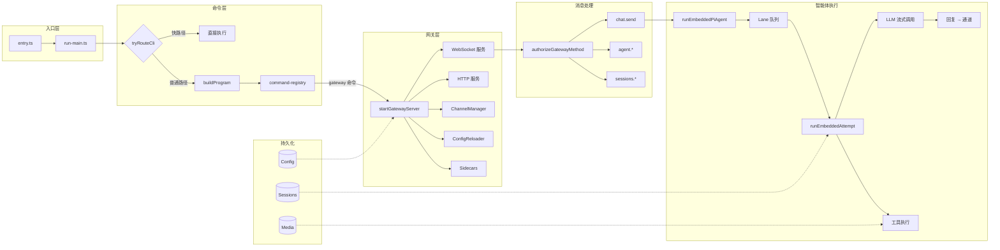
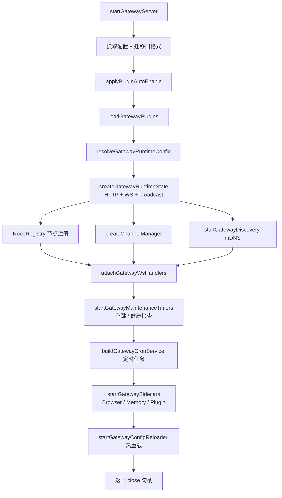
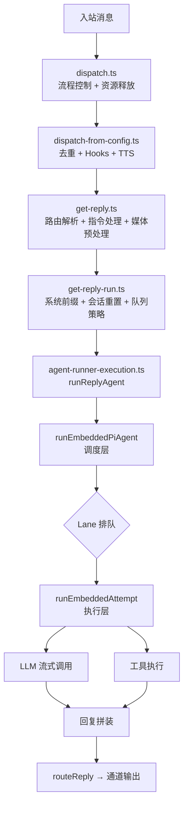

# OpenClaw 系统架构详解

本文从技术视角全面剖析 OpenClaw 的系统架构，适合希望深入理解或二次开发的读者。

---

## 一、架构总览

OpenClaw 是一个**多通道 AI 助手运行时**，核心设计目标：

- **多通道统一接入**：Telegram、WhatsApp、Discord、iMessage 等，使用同一套内核
- **高可扩展插件化**：通道、工具、Provider、Hooks 均可通过插件注入
- **长连接控制平面**：Gateway 以 WebSocket 为核心，支持流式事件与状态广播
- **智能体内核稳定运行**：Lane 队列、上下文守护、模型回退，保证长期可靠执行

### 整体分层

```text
┌─────────────────────────────────────────────────────┐
│                   CLI 层                            │
│        entry.ts → run-main.ts → command-registry    │
├─────────────────────────────────────────────────────┤
│                  Gateway 层（控制平面）               │
│    WebSocket 服务 · HTTP 服务 · 通道管理 · 热重载     │
├──────────────┬──────────────┬────────────────────────┤
│  Channel 层  │   Routing 层 │    Plugin 层            │
│  多通道适配  │  路由 + 会话键│  工具/通道/Provider 注册 │
├──────────────┴──────────────┴────────────────────────┤
│               Auto-Reply / Agent 执行层               │
│   dispatch → get-reply → agent-runner → embedded PI  │
├─────────────────────────────────────────────────────┤
│                AI Provider 层                        │
│    Anthropic · OpenAI · Ollama · Bedrock · ...       │
├─────────────────────────────────────────────────────┤
│              持久化 / 基础设施层                       │
│       Config · Sessions · Media · Security · Cron    │
└─────────────────────────────────────────────────────┘
```

### 模块关系全图



---

## 二、核心组件详解

### 2.1 CLI 层

**源码位置**：`src/entry.ts`、`src/cli/`

CLI 是系统的启动入口，负责环境初始化和命令分发。

```text
入口流程：
entry.ts
  ├── 设置进程名 "openclaw"
  ├── 处理 --no-color 标志
  ├── 通过 respawn 注入 --disable-warning=ExperimentalWarning
  ├── Windows argv 归一化（normalizeWindowsArgv）
  ├── CLI Profile 解析（parseCliProfileArgs / applyCliProfileEnv）
  └── run-main.ts
        ├── 加载 .env，标准化环境变量
        ├── tryRouteCli() → 快路径命令（直接执行，跳过完整注册）
        │   例：status / health / sessions / agents list /
        │       memory status / config get / models list
        └── buildProgram() + registerCoreCliByName()
              → 按主命令名懒加载注册对应子命令模块
```

**快路径设计**：`src/cli/program/routes.ts` 定义了可绕过完整命令注册、直接执行的命令（如 `status`、`health`），显著缩短冷启动时间。

**懒加载命令注册**：`command-registry.ts` 按需加载子命令模块，避免一次性全量加载。

---

### 2.2 Gateway 层（控制平面）

**源码位置**：`src/gateway/`

Gateway 是整个系统的核心，**必须常驻运行**。它暴露两个接口：

| 接口 | 默认地址 | 用途 |
|------|----------|------|
| WebSocket | `127.0.0.1:18789` | 主控制协议，所有方法调用、事件推送 |
| HTTP | 同端口 | Hooks 回调、工具调用、Slack、OpenResponses |

#### Gateway 启动序列



#### WebSocket 协议层（4 层结构）

```text
1. 连接层  server/ws-connection.ts + server/ws-connection/message-handler.ts
   └── 握手认证、Challenge/Response、10s 握手超时保护

2. 协议层  gateway/protocol/index.ts
   └── AJV 帧结构校验、统一错误码

3. 方法层  server-methods.ts + server-methods/*
   └── authorizeGatewayMethod（role + scope）+ 方法分发

4. 事件层  server-broadcast.ts + server-chat.ts
   └── 流式事件广播、慢消费者丢弃、幂等缓存
```

#### 三个"总闸"

| 总闸 | 源码 | 作用 |
|------|------|------|
| 连接总闸 | `message-handler.ts` | `connect` 握手必须成功，否则关闭 WS |
| 权限总闸 | `authorizeGatewayMethod` | role/scope 不符合直接拒绝 |
| 带宽总闸 | `MAX_PAYLOAD_BYTES` | 防止单连接拖垮系统 |

#### 配置热重载

`startGatewayConfigReloader` 监听配置文件变化，能热更新的直接 `applyHotReload`，不能热更新的请求进程重启——**无需杀死 Gateway 进程**。

---

### 2.3 Channel 层（通道适配器）

**源码位置**：`src/channels/`、各通道插件目录（`src/discord/`、`src/imessage/` 等）

通道是消息的"入口"与"出口"。每个通道以插件形式注册：

```typescript
// 通道注册示意
registerChannel({
  id: "telegram",
  label: "Telegram",
  start: async (accountId, config) => { /* 启动 bot */ },
  stop: async (accountId) => { /* 停止 */ },
  send: async (target, message) => { /* 发送消息 */ },
})
```

**内置通道（`src/channels/registry.ts` CHAT_CHANNEL_ORDER）：**

| 通道 | selectionLabel | 说明 |
|------|----------------|------|
| Telegram | Telegram (Bot API) | 官方 Bot，入门首选 |
| WhatsApp | WhatsApp (QR link) | 绑定手机号，推荐独立设备 |
| Discord | Discord (Bot API) | 官方 Bot，支持良好 |
| IRC | IRC (Server + Nick) | 经典聊天室协议 |
| Google Chat | Google Chat (Chat API) | Google Workspace HTTP Webhook |
| Slack | Slack (Socket Mode) | 企业通讯，Socket Mode |
| Signal | Signal (signal-cli) | 私密通讯，需额外配置 |
| iMessage | iMessage (imsg) | 仅 macOS，仍在完善中 |

**账号是一级实体**：同一通道可运行多个 `accountId`，每个账号独立运行状态，故障隔离。

---

### 2.4 Routing 层（路由与会话键）

**源码位置**：`src/routing/`

路由层负责把"某条入站消息"稳定映射到"某个 Agent + 某个 Session"。

#### 路由匹配优先级（从高到低）

```text
1. peer 精确匹配（私聊对象 ID）
2. parent peer 继承匹配（线程/回复链）
3. guild + roles（服务器 + 角色组合）
4. guild（整个服务器）
5. team（团队）
6. account（账号）
7. channel（整个通道）
8. default agent（兜底）
```

#### Session Key 设计

Session Key 是并发隔离和持久化分区的核心。格式（`src/routing/session-key.ts`）：

```text
私聊（DM）：agent:{agentId}:{channel}:{accountId}:direct:{peerId}
群聊/频道：agent:{agentId}:{channel}:{accountId}:{peerKind}:{peerId}

其中 peerKind = direct | group | channel | thread | ...
```

路由匹配阶段使用 `channel + accountId + peer + guildId + teamId + memberRoleIds` 等多个维度决策，但编入 Key 字符串的仅是 `agentId + channel + accountId + peerKind + peerId`。

**作用**：
- 同一会话消息串联（历史上下文）
- 并发队列按 session 隔离（Lane 机制）
- 存储文件按 session 定位

---

### 2.5 Auto-Reply / Agent 执行层

**源码位置**：`src/auto-reply/`、`src/agents/`

这是系统最复杂的部分，分为 5 个子层：

#### 执行流水线总览



#### 各子层职责

| 子层 | 文件 | 核心职责 |
|------|------|----------|
| 调度控制 | `dispatch.ts` | typing/block/final 事件、资源保证释放 |
| 消息编排 | `dispatch-from-config.ts` | 去重、Hooks、TTS 应用 |
| 决策构建 | `get-reply.ts` | 路由解析、指令解析、媒体预处理 |
| 执行组装 | `get-reply-run.ts` | 系统前缀、队列策略、模型思考等级 |
| Agent 调度 | `pi-embedded-runner/run.ts` | Lane 排队、模型选择、执行循环 |
| 单次执行 | `pi-embedded-runner/run/attempt.ts` | 真实 LLM 调用 + 工具执行 |
| 事件订阅 | `pi-embedded-subscribe.ts` | 流式文本/工具事件分离收集 |
| 模型回退 | `model-fallback.ts` | 多候选模型轮换 |

#### Lane 并发模型

```text
每个 Session 独占一个 Session Lane（队列）
所有 Session 共享一个 Global Lane（全局并发控制）
Lane 由 concurrency（最大同时执行数）和 maxPending（最大排队数）控制

消息到来：入队 sessionLane → 入队 globalLane → 执行
新消息到来时的 QueueMode（src/auto-reply/reply/queue/types.ts）：
  - interrupt    ：中断当前 run，立即执行新消息
  - steer        ：把新消息追加到当前 run 的上下文中继续执行
  - steer-backlog：steer 的变体，同时保留待处理消息
  - followup     ：等当前 run 结束后再执行
  - collect      ：收集多条消息合并后再执行（防抖批处理）
  - queue        ：普通排队，依序执行
```

#### 上下文守护（防止"越聊越炸"）

```text
上下文稳定 = 窗口预检 + 历史卫生 + 配对修复 + 压缩重试 + 超时快照兜底

CONTEXT_WINDOW_HARD_MIN_TOKENS = 16000   // 硬红线，触发拒绝
CONTEXT_WINDOW_WARN_BELOW_TOKENS = 32000 // 软警告，触发压缩
```

---

### 2.6 AI Provider 层

**源码位置**：`src/providers/`、`src/agents/auth-profiles/`

Provider 层抽象了所有 AI 模型服务的接入差异。

#### 支持的 Provider（部分，完整列表见 `src/agents/models-config.providers.ts`）

| Provider | 认证方式 | 说明 |
|----------|----------|------|
| Anthropic (Claude) | API Key | 原生最优支持 |
| OpenAI (GPT) | API Key | 广泛兼容 |
| Ollama | 本地 HTTP | 无需云服务，完全私有 |
| AWS Bedrock | IAM | 企业级云服务 |
| Google Gemini | API Key | 多模态支持 |
| GitHub Copilot | OAuth | 企业授权 |
| Qwen（通义）| Portal OAuth | 阿里云 |
| Moonshot（Kimi）| API Key | 月之暗面 |
| Together / HuggingFace | API Key | 开源模型托管 |
| Cloudflare AI Gateway | API Key | 代理聚合层 |

#### Auth Profile 轮换机制

支持配置多个 Auth Profile（不同 Key），当某个 Key 遇到限流或认证失败时，自动轮换到下一个：

```text
runWithModelFallback():
  遍历候选 profile 列表
  → 尝试执行
  → 失败（限流/认证）→ 标记冷却 → 轮换下一个
  → 全部失败 → 返回最终错误
```

---

### 2.7 Plugin 系统

**源码位置**：`src/plugins/`

插件是 OpenClaw 的扩展骨架，支持 5 种注入点：

```text
插件可注入：
  ① channel    → 新通道（Telegram/Discord/...）
  ② tool       → 新 Agent 工具（bash/browser/...）
  ③ provider   → 新 AI Provider
  ④ hook       → 生命周期钩子（message_received/gateway_stop/...）
  ⑤ http-route → 新 HTTP 路由（Webhook 处理等）
```

**插件加载流程**：

```text
loadGatewayPlugins()
  → 扫描 bundled 插件 + 用户安装插件
  → 执行插件 manifest 校验
  → 注册到全局 registry
  → 冲突检测（同名注册报错）
```

---

### 2.8 持久化 / 基础设施层

| 子系统 | 源码 | 说明 |
|--------|------|------|
| Config | `src/config/io.ts` | TOML 格式配置，热重载支持 |
| Sessions | `src/config/sessions/store.ts` | 会话历史持久化，按 sessionKey 分区 |
| Media | `src/media/store.ts` + `server.ts` | 媒体文件管理，有 TTL 和安全校验 |
| Security | `src/security/audit.ts` | 操作审计日志 |
| Cron | `src/cron/` | 定时任务（会话清理、维护等） |
| Daemon | `src/daemon/` | 守护进程管理，保证 Gateway 常驻 |
| Memory | `src/memory/` | Agent 记忆 sidecar |

---

## 三、消息完整旅程

以"在 Telegram 发送一条消息"为例：

```text
① 用户发消息
   Telegram 服务器 → Telegram Bot（Webhook / Long Poll）

② 通道适配器接收
   Telegram 插件（通过 Plugin Registry 注册）
   → 构造标准 InboundMessage 对象

③ 路由解析
   src/routing/resolve-route.ts
   → 计算 agentId + sessionKey

④ 自动回复调度
   src/auto-reply/dispatch.ts
   → 触发 message_received hooks
   → 显示 typing 指示器

⑤ 回复决策
   get-reply.ts
   → 解析 @指令（/think、/model、/reset 等）
   → 媒体理解预处理（图片/文件）

⑥ 执行组装
   get-reply-run.ts
   → 拼装系统提示、用户上下文
   → 确定队列策略（interrupt/steer/followup）

⑦ Agent 调度
   runEmbeddedPiAgent()
   → 进入 sessionLane 队列
   → 进入 globalLane 队列

⑧ 单次执行
   runEmbeddedAttempt()
   → 上下文窗口预检
   → 发起 LLM 流式调用（Anthropic API）

⑨ 流式输出处理
   pi-embedded-subscribe.ts
   → 收集文本 token
   → 检测工具调用（tool_use 事件）

⑩ 工具执行（如有）
   openclaw-tools.ts → bash / browser / file 等工具
   → 结果追加到会话上下文
   → 继续 LLM 调用（多轮 agentic loop）

⑪ 回复下发
   routeReply()
   → 通道适配器 send()
   → Telegram API 发送消息

⑫ 用户收到回复 ✅
```

---

## 四、安全架构

### 4.1 配对（Pairing）机制

陌生来源的消息**不会直接触发 AI 回复**，而是进入等待审批流：

```text
未配对消息 → 发出配对码 → 人工审批
                              ↓ approve
                           加入白名单 → 允许 AI 回复
                              ↓ reject
                           永久拒绝
```

### 4.2 工具执行审批

危险工具（如 bash 命令）可配置需要人工审批：

```text
工具调用请求
  → 检查 dangerous-tools.ts 规则
  → 需要审批 → 推送审批请求到控制端
              → 等待 approve/reject
  → 免审批   → 直接执行
```

### 4.3 Gateway 鉴权层级

鉴权由 `src/gateway/server-methods.ts` 的 `authorizeGatewayMethod()` 执行：

```text
角色（Role）：
  operator  → 常规客户端（控制台、CLI、配对设备等）
  node      → 节点角色（node-host，仅允许 node.* 方法）

Scope（operator 角色的细粒度权限）：
  operator.read      → 读取状态、会话、配置等
  operator.write     → 写入配置、发送消息、控制 Agent
  operator.admin     → 管理员操作（通道管理、系统级控制）
  operator.approvals → 工具执行审批
  operator.pairing   → 配对管理（approve/reject/list）
```

### 4.4 审计日志

所有敏感操作写入审计日志（`src/security/audit.ts`），包括：配置变更、工具执行、权限变更、连接事件。

---

## 五、部署架构

### 5.1 单机部署（默认）

```text
┌─────────────────────────────────┐
│          用户电脑               │
│                                 │
│  openclaw gateway               │
│  ├── 127.0.0.1:18789 (WS/HTTP) │
│  ├── Channel sidecars           │
│  └── Memory sidecar             │
│                                 │
│  ~/.openclaw/                   │
│  ├── config.toml                │
│  ├── sessions/                  │
│  └── workspace/                 │
└─────────────────────────────────┘
         ↓ 通过 Tailscale / VPN
  远程设备（手机/平板）
```

### 5.2 服务器部署

```text
┌──────────────────────────────────────┐
│           云服务器 / VPS             │
│                                      │
│  Docker / systemd 守护 openclaw      │
│  ├── Gateway :18789                  │
│  ├── 反向代理（nginx/caddy）         │
│  │   └── TLS 终止 + 外网暴露         │
│  └── 持久化卷挂载                    │
└──────────────────────────────────────┘
```

### 5.3 守护进程管理

`src/daemon/` 提供守护进程能力：

- 进程崩溃自动重启
- PID 文件管理
- 优雅关停（`SIGTERM` → drain → close）

---

## 六、核心源码索引

| 模块 | 关键文件 |
|------|----------|
| CLI 入口 | `src/entry.ts`, `src/cli/run-main.ts` |
| 命令注册 | `src/cli/program/build-program.ts`, `src/cli/program/command-registry.ts` |
| Gateway 主入口 | `src/gateway/server.impl.ts` |
| WS 握手认证 | `src/gateway/server/ws-connection.ts`, `src/gateway/auth.ts` |
| 方法鉴权 | `src/gateway/server-methods.ts` |
| 通道管理 | `src/gateway/server-channels.ts` |
| 路由解析 | `src/routing/resolve-route.ts`, `src/routing/session-key.ts` |
| 自动回复入口 | `src/auto-reply/dispatch.ts`, `src/auto-reply/reply/get-reply.ts` |
| Agent 调度 | `src/agents/pi-embedded-runner/run.ts` |
| 单次执行 | `src/agents/pi-embedded-runner/run/attempt.ts` |
| 工具系统 | `src/agents/pi-tools.ts`, `src/agents/openclaw-tools.ts` |
| 上下文守护 | `src/agents/context-window-guard.ts` |
| 模型回退 | `src/agents/model-fallback.ts` |
| 子智能体 | `src/agents/tools/sessions-spawn-tool.ts` |
| 技能系统 | `src/agents/skills.ts` |
| 插件加载 | `src/plugins/loader.ts`, `src/plugins/registry.ts` |
| 配置 IO | `src/config/io.ts` |
| 会话存储 | `src/config/sessions/store.ts` |
| 媒体管理 | `src/media/store.ts`, `src/media/server.ts` |
| 安全审计 | `src/security/audit.ts` |

---

## 七、扩展阅读

- [Gateway 网络模型](/tutorials/gateway/network-model)
- [OpenClaw 是怎么工作的（入门版）](/tutorials/concepts/architecture)
- [Agent 执行循环](/tutorials/concepts/agent-loop)
- [会话管理](/tutorials/concepts/session)
- [模型故障转移](/tutorials/concepts/model-failover)
- [插件开发（源码剖析 · 插件系统）](/beginner-openclaw-guide/08-插件系统)
- [智能体框架总览](/beginner-openclaw-guide/12-智能体框架总览)
